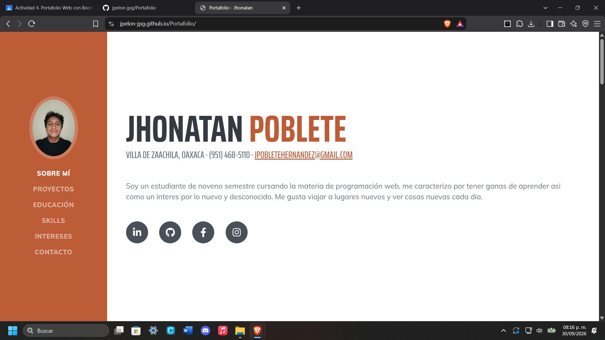
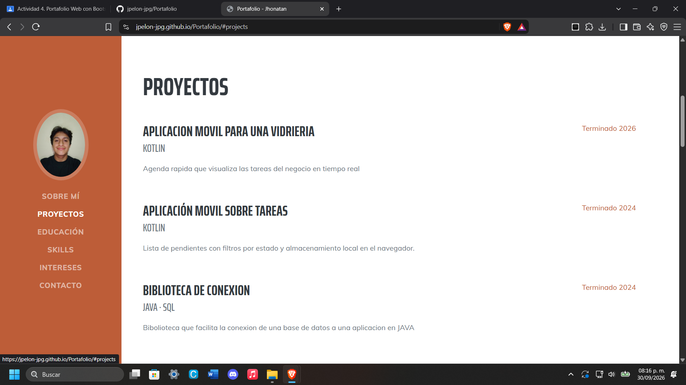
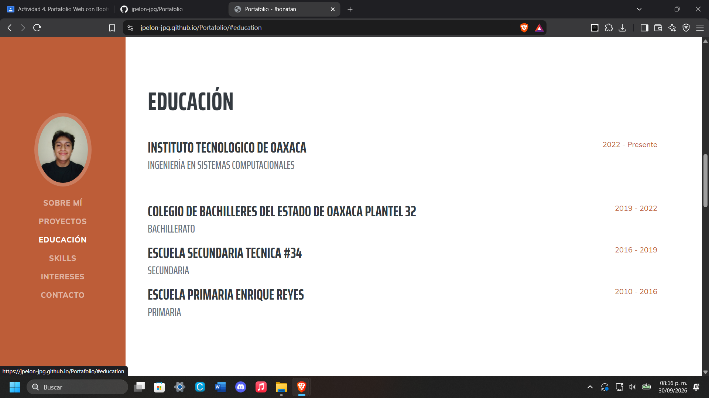
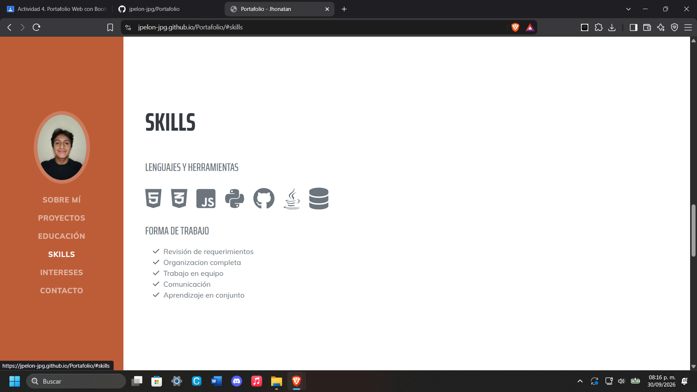

# 💼 Portafolio Personal – Jhonatan Poblete

Portafolio web personal hecho con **HTML, CSS y JavaScript** sobre la plantilla *Resume* de Start Bootstrap. Presenta mi perfil como estudiante de Ingeniería en Sistemas Computacionales, mis proyectos, mi formación, mis habilidades y mis metas de certificación.

---

## 📑 Contenido
1. [Descripción del proyecto](#-descripción-del-proyecto)
2. [Secciones del portafolio](#-secciones-del-portafolio)
3. [Estructura del repositorio](#-estructura-del-repositorio)
4. [Proceso de creación](#-proceso-de-creación)
5. [Modificaciones a la plantilla](#-modificaciones-a-la-plantilla)
6. [Cómo ejecutarlo localmente](#-cómo-ejecutarlo-localmente)
7. [Publicación en GitHub Pages](#-publicación-en-github-pages)
8. [Capturas de pantalla](#-capturas-de-pantalla)
9. [Créditos y licencia](#-créditos-y-licencia)
10. [Contacto](#-contacto)

---

## 📝 Descripción del proyecto

| Dato | Detalle |
|---|---|
| **Framework CSS** | Bootstrap 5.2.3 (incluido en la plantilla). No se mezcla con Tailwind. |
| **Plantilla** | Start Bootstrap – **Resume** v7.0.6 |
| **Descarga de la plantilla** | https://startbootstrap.com/theme/resume |
| **Repositorio de la plantilla** | https://github.com/StartBootstrap/startbootstrap-resume |
| **Íconos** | Font Awesome 6.3 (versión gratuita, por CDN) |
| **Tipografías** | Google Fonts: Saira Extra Condensed y Muli |
| **JavaScript** | JavaScript puro (sin React, Vue ni otros frameworks) |

El diseño tiene un menú lateral fijo con la foto de perfil en pantallas grandes, que en celular se convierte en una barra superior desplegable. La navegación hace scroll suave entre secciones y resalta la sección activa mediante ScrollSpy de Bootstrap.

## 🧭 Secciones del portafolio

**Menú de navegación (barra lateral):** Sobre mí · Proyectos · Educación · Skills · Intereses · Contacto. Al hacer clic en cada opción, la página se desplaza a la sección correspondiente.

| Sección | Descripción |
|---|---|
| **Sobre mí** | Nombre, ubicación, teléfono, correo, una breve presentación personal y botones a mis redes: LinkedIn, GitHub, Facebook e Instagram. |
| **Proyectos** | Proyectos que he desarrollado (apps móviles en Kotlin y una biblioteca de conexión a bases de datos en Java), con tecnologías y año. |
| **Educación** | Trayectoria académica: Instituto Tecnológico de Oaxaca, Bachilleres Plantel 32, Secundaria Técnica No. 34 y Primaria Enrique Reyes. |
| **Skills** | Íconos de las tecnologías que manejo (HTML, CSS, JavaScript, Python, Java, GitHub y SQL) y mi forma de trabajo. |
| **Intereses** | Pasatiempos e intereses personales y tecnológicos. |
| **Certificaciones y contacto** | Certificaciones que planeo obtener y mi correo de contacto. |

## 📂 Estructura del repositorio

```
Portafolio/
├── index.html            # Página principal
├── README.md             # Documentación
├── css/
│   └── portafolio.css    # Estilos (Bootstrap + tema Resume)
├── js/
│   └── portafolio.js     # Scripts: ScrollSpy y cierre del menú móvil
└── img/                  # Foto de perfil y capturas de pantalla
```

## 🛠️ Proceso de creación

1. **Elección de la plantilla.** Descargué *Resume* de Start Bootstrap desde https://startbootstrap.com/theme/resume. *Por qué:* su diseño de currículum con menú lateral encaja con un portafolio personal y ya está hecho con Bootstrap.
2. **Revisión de archivos.** Estudié el `index.html`, el CSS compilado de Bootstrap y el `scripts.js` de la plantilla. *Por qué:* para saber qué partes cambiar y cuáles dejar intactas.
3. **Estructura del repositorio.** Creé las carpetas `css`, `js` e `img`, y renombré `styles.css` → `portafolio.css` y `scripts.js` → `portafolio.js`, actualizando los enlaces en `index.html`. *Por qué:* para cumplir con la estructura pedida y mantener el proyecto ordenado.
4. **Contenido propio.** Reemplacé los datos de ejemplo por mi información y traduje todo al español. *Por qué:* el portafolio debe representarme a mí y estar en mi idioma.
5. **Foto de perfil.** Sustituí la imagen de la plantilla por mi foto personal en `img/`. *Por qué:* es el elemento que da identidad y profesionalismo al portafolio.
6. **Secciones adaptadas.** Cambié *Experience* por *Proyectos* y *Awards* por *Certificaciones y contacto*, y amplié *Educación*. *Por qué:* aún no tengo experiencia laboral formal, pero sí proyectos y metas que mostrar.
7. **Skills y redes.** Quité los íconos de frameworks JS, agregué SQL y añadí Facebook e Instagram. *Por qué:* el proyecto no usa frameworks de JavaScript y quería más formas de contacto.
8. **Pruebas.** Revisé el menú, el scroll entre secciones y la vista en celular y escritorio. *Por qué:* para confirmar que todo funciona y es responsivo.
9. **Control de versiones.** Inicialicé Git en la carpeta del proyecto, lo vinculé al repositorio remoto y subí los archivos con `git add`, `git commit` y `git push`.
10. **Publicación.** Activé GitHub Pages desde la rama `main`, para que el portafolio sea accesible en línea.

## ✏️ Modificaciones a la plantilla

| Cambio | Motivo |
|---|---|
| Se cambió *Experience* por **Proyectos** | Muestra mi trabajo real como estudiante, en lugar de experiencia laboral. |
| Se cambió *Awards* por **Certificaciones y contacto** | Presenta las certificaciones que quiero alcanzar y centraliza el contacto. |
| Se amplió **Educación** a cuatro niveles | Mostrar mi trayectoria académica completa. |
| Se eliminaron los íconos de Angular, React y otros | Este proyecto no usa frameworks de JavaScript; solo muestro lo que manejo. |
| Se agregó el ícono de base de datos | Representar mis conocimientos de SQL. |
| Se agregaron Facebook e Instagram | Ofrecer más formas de contacto. |
| Se tradujo todo el contenido al español | Adaptarlo a mi idioma y audiencia. |
| Se quitó el favicon y la carpeta `assets` | Simplificar la estructura al formato `css/js/img`. |

## 💻 Cómo ejecutarlo localmente

```bash
# 1. Clonar el repositorio
git clone https://github.com/jpelon-jpg/Portafolio.git

# 2. Entrar a la carpeta
cd Portafolio

# 3. Abrir index.html en el navegador (doble clic), o servirlo con XAMPP
```

No requiere instalación ni dependencias: Bootstrap, Font Awesome y las fuentes se cargan por CDN, por lo que solo necesitas conexión a internet.

## 🌐 Publicación en GitHub Pages

1. En el repositorio, ir a **Settings → Pages**.
2. En *Source*, elegir **Deploy from a branch**.
3. Seleccionar la rama **main** y la carpeta **/ (root)**, y guardar.
4. Tras uno o dos minutos, el sitio queda disponible en:
   **https://jpelon-jpg.github.io/Portafolio/**

## 📸 Capturas de pantalla

### Inicio / Sobre mí


### Proyectos


### Educación y Skills




## 📜 Créditos y licencia

- Plantilla: [Start Bootstrap – Resume](https://startbootstrap.com/theme/resume), © 2013-2023 Start Bootstrap, bajo licencia [MIT](https://github.com/StartBootstrap/startbootstrap-resume/blob/master/LICENSE).
- Íconos: [Font Awesome](https://fontawesome.com/) (versión gratuita).
- Tipografías: [Google Fonts](https://fonts.google.com/).

El contenido personal (textos y fotografías) es de mi autoría.

## 📬 Contacto

**Jhonatan Poblete** – Villa de Zaachila, Oaxaca
- ✉️ jpobletehernandez@gmail.com
- 💼 [LinkedIn](https://linkedin.com/in/jhonatan-poblete-7b8957418/)
- 🐙 [GitHub](https://github.com/jpelon-jpg/)
- 📘 [Facebook](https://facebook.com/jhomatan.poblete)
- 📷 [Instagram](https://instagram.com/jp.elon)
